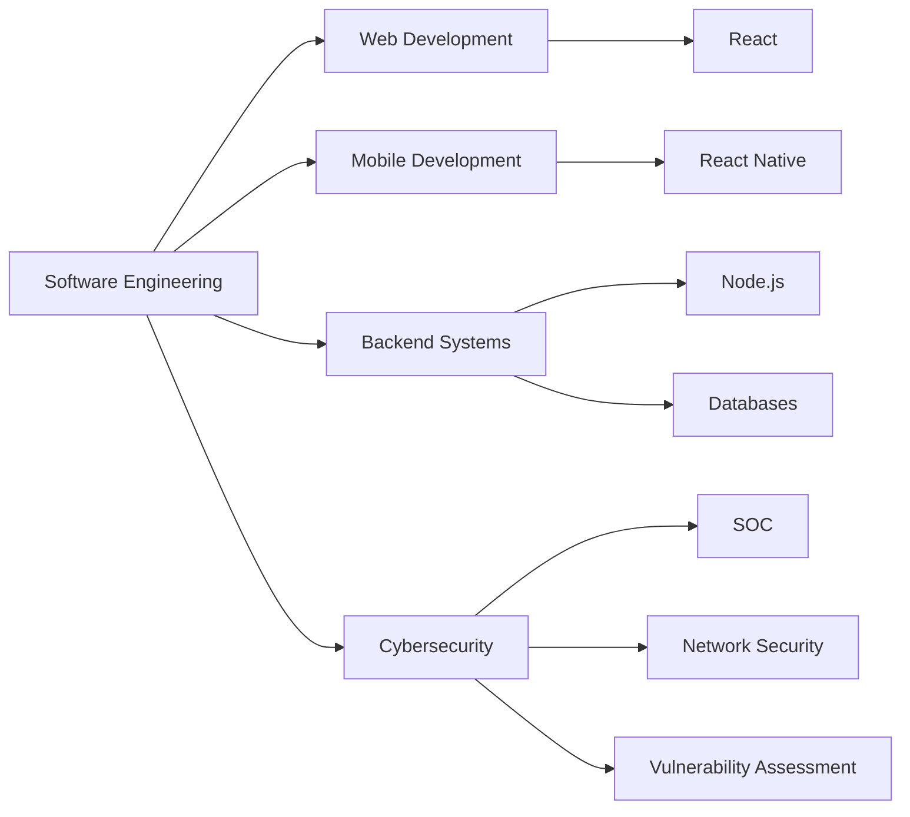

<div align="center">

# Hi, I'm Pascal Albert

### Software Engineer | Web & Mobile Developer | Cybersecurity Enthusiast

I build practical web and mobile applications while continuously growing my skills in backend development, databases, software architecture, and cybersecurity.

[](https://github.com/perskull12)
[](https://www.linkedin.com/in/pascal-otieno-11015921b)
[](https://github.com/perskull12)

</div>

---

## About Me

```javascript
const pascal = {
  role: "Software Engineer",
  education: "B.Tech in Information Technology",

  interests: [
    "Web Development",
    "Mobile Development",
    "Backend Engineering",
    "Cybersecurity"
  ],

  currentlyLearning: [
    "Advanced React",
    "React Native",
    "Node.js",
    "Software Architecture",
    "Cybersecurity"
  ],

  goal: "Build secure, useful and maintainable software"
};
```

I'm an early-career **Software Engineer** interested in building applications that solve practical problems.

My main areas of interest are:

* Web application development
* Mobile application development
* Backend systems
* Database design
* Secure software development
* SOC operations
* Vulnerability assessment
* Penetration testing

I enjoy learning through hands-on projects and continuously improving how I design, build, and secure applications.

---

# Tech Stack

## Languages

<p>

</p>

`JavaScript` `TypeScript` `Python` `Kotlin` `SQL` `HTML` `CSS`

---

## Frontend

<p>

</p>

`React.js` `React Native` `Expo` `Vite`

---

## Backend

<p>

</p>

`Node.js` `Express.js` `REST APIs`

---

## Databases

<p>

</p>

`MySQL` `SQLite` `Appwrite`

---

## Development Tools

<p>

</p>

`Git` `GitHub` `VS Code` `Postman` 

---

## Cybersecurity

```text
Vulnerability Assessment
SOC Monitoring
Network Security
OSINT
MITRE ATT&CK
TCP/IP
Nmap
Wireshark
Metasploit
Linux
```

---

Featured project
## What's For Eat

**Food Recommendation Application**

What's For Eat helps users decide what to eat or cook based on their available ingredients and preferred meal type.

### Features

* Lunch recommendations
* Supper recommendations
* Ingredient-based meal discovery
* Dish search
* Food API integration
* Personalized meal discovery

### Stack

`React.js` `JavaScript` `Node.js` `REST APIs`

[Live demo](https://whatsforeat.vercel.app/)

---

# Currently Learning

```text
Advanced React.js
React Native
Backend Development
REST API Design
Software Architecture
Database Design
Secure Application Development
SOC Operations
Penetration Testing
Cybersecurity
```

---

# GitHub Analytics

<div align="center">


</div>

---

# GitHub Streak

<div align="center">


</div>

---

# Contribution Activity

<div align="center">


</div>

---

# My Development Focus



---

# Goals

* Build more production-ready applications
* Improve my software architecture knowledge
* Strengthen backend development skills
* Build secure and maintainable systems
* Contribute to open-source projects
* Continue developing practical cybersecurity skills
* Grow professionally as a Software Engineer

---

# Let's Connect

I'm interested in connecting with developers, cybersecurity professionals, and people building useful technology.

<p align="center">

<a href="https://github.com/perskull12">

</a>

<a href="https://www.linkedin.com/in/pascal-otieno-11015921b">

</a>

</p>

---

<div align="center">

### Build. Learn. Improve. Repeat.

Thanks for visiting my profile.

</div>
